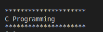

#Assignment1 
Write C Program to Print a Sentence i should see the Console as following:
### 
 C Programming 
 

#Solution 

    #include<stdio.h>
    int main()
    {

        printf("*********************\n");
        printf("    C Programming\n    ");
        printf("*********************\n");
        return 0;

    }

# :writing_hand: Demo 

