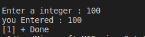

#Assignment2 

Write C Program to Print a Integer Entered by a User
i should see the Console as following:

########## onsole-output ########

### 
 Enter a integer: 25   You entered: 25  
 

#Solution 

    #include<stdio.h>
    void main ()
    {
        int var1;
        printf("Enter a integer : ");
        scanf("%d",&var1);
        printf("you Entered : %d\n",var1);
    }

# :writing_hand: Demo 
