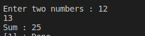

#Assignment3 

Write C Program to Add Two Integers

i should see the Console as following:

########## Console-output ########

### 
 Enter two integers: 12  11   Sum: 23 
 

#Solution 

    #include<stdio.h>
    void main ()
    {
        int  var1,var2;
        printf("Enter two numbers : ");
        scanf("%d %d",&var1,&var2);
        printf("Sum : %d\n",var1+var2);
    }

# :writing_hand: Demo 
