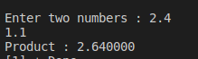

#Assignment3 

EX4:
 Write C Program to Multiply two Floating Point Numbers
i should see the Console as following:

########## Console-output ########

### 
 nter two numbers: 2.4   1.1   Product: 2.640000
 

#Solution 

    #include<stdio.h>
    void main ()
    {
        float  var1,var2;
        printf("Enter two numbers : ");
        scanf("%f %f",&var1,&var2);
        printf("Product : %f\n",var1*var2);
    }   
# :writing_hand: Demo 
