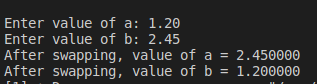

#Assignment6

EX6:

Write Source Code to Swap Two Numbers

#########Console_output######
Enter value of a: 1.20
Enter value of b: 2.45

After swapping, value of a = 2.45
After swapping, value of b = 1.2

########## Console-output ########

### 
 Enter value of a: 1.20    Enter value of b: 2.45  After swapping, value of a = 2.45   After swapping, value of b = 1.2 
 

#Solution 

    #include<stdio.h>
    void main ()
    {
        float var1,var2,tmp;
        printf("Enter value of a: ");
        scanf("%f",&var1);
        printf("Enter value of b: ");
        scanf("%f",&var2);
        // Swapping process 
        tmp = var1 ;
        var1= var2;
        var2 = tmp; 

        printf("After swapping, value of a = %f \n",var1);
        printf("After swapping, value of b = %f \n",var2);
    }
# :writing_hand: Demo 
