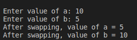

#Assignment7
EX7:
it is an interview trick

Write Source Code to Swap Two Numbers without temp variable.
<p style =" color : red; text-align :center ">########## Console-output ########</p>

### <p style ="color : white; background-color : black ;text-align : left ; font-size:20px " > Enter value of a: 1.20  <br> Enter value of b: 2.45 <br>After swapping, value of a = 2.45 <br> After swapping, value of b = 1.2 </p> 

#The Idea 
we should in a mathmatical way 
the question is operation that if apply it on two variables and repeat it again i get two variables swapped 
## let's think in mathematical operations 
:thinking: what if we used add operation 
` var1 = var1+var2   ` 
So :smiley: if we subtract var2 from var1 we get orginial var1 value
`var2 = var1-var2` 
So :smiley: if we repeated the same operation again we get the original value of var2 
`var1 = var1-var2 `

##Anther way 
:thinking: what about bitwize operation 
Let's try **XOR**
```c
var1 ^= var2
var2 ^= var1
var1 ^= var2
```
to understand it convert them to binary and perform every line operation 
##Anther Way 
**mix between bitwize and arithmatic operators**
```c
        // same as a = a + b
        a = (a & b) + (a | b);
    
        // same as b = a - b
        b = a + (~b) + 1;
    
        // same as a = a - b
        a = a + (~b) + 1;`
```
#Solution 
we implemented second method only 
``` c
#include<stdio.h>
void main ()
{
    int  var1,var2;
    printf("Enter value of a: ");
    scanf("%d",&var1);
    printf("Enter value of b: ");
    scanf("%d",&var2);
    // Swapping process 
    var1 ^=var2;
    var2 ^=var1;
    var1 ^=var2;

    printf("After swapping, value of a = %d \n",var1);
    printf("After swapping, value of b = %d \n",var2);
}
```
# :writing_hand: Demo 
