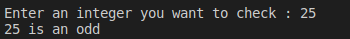
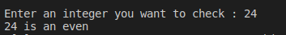

#Assignment1
write a C program to check whether a Number is Even or Odd 
<p style =" color : red; text-align :center ">########## Console-output ########</p>

### <p style ="color : white; background-color : black ;text-align : left ; font-size:20px " >Enter an integer you want to check : 24 <br> 24 is even  </p> 

#The Idea 
the idea here is **%** operator 
as we know any number if we take it's modlus by 2 
there is two and only two solutions 
1- 0 if the number is  **even**
2- 1 if the number is **odd** 
#Solution 
``` c
#include<stdio.h>
void main ()
{
    int  var1;
    printf("Enter an integer you want to check : ");
    scanf("%d",&var1);
    if (var1 % 2==0)
    {
        printf("%d is an even \n ",var1);

    }
    else 
    {
        printf("%d is an odd \n ",var1);
    }
}
```
# :writing_hand: Demo 

