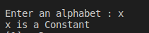

#Assignment2
write a C program to check vowel or constant 
<p style =" color : red; text-align :center ">########## Console-output ########</p>

### <p style ="color : white; background-color : black ;text-align : left ; font-size:20px " >Enter an alphabet : x <br> x is constant  </p> 

#The Idea 
the idea is very simple 
as we know that a vowel characters is {a,e,i,o,u}
so any other character is a constant 
:thinking: `switch ` will do that 
``` c
#include<stdio.h>
#include<ctype.h>
void main ()
{
    char var1;
    printf("Enter an alphabet : ");
    scanf("%c",&var1);
// this condition to check that the char is alphabet 
    if (isalpha(var1))
    {
        switch (var1)
        {

        
        case 'a':
        case 'e':
        case 'i':
        case 'o':
        case 'u':
        {
            printf("%c is a Vowel \n ",var1);
            break;
        }
        default:
        {
            printf("%c is a Constant \n",var1);

            break;
        }
        }

    }
    else 
    {
        printf("this not alpha ");
    }
}
```
# :writing_hand: Demo 

