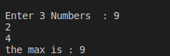

#Assignment3
write a C program to max of three numbers  
<p style =" color : red; text-align :center ">########## Console-output ########</p>

### <p style ="color : white; background-color : black ;text-align : left ; font-size:20px " >Enter 3 Numbers : 9  <br> 5 <br> 2<br> the max is : 9  </p> 

#The Idea 
the idea is very simple 
we can solve it with a trivial soltion like `if` 
``` c
#include<stdio.h>
void main ()
{
    int var1,var2,var3,max;
    printf("Enter 3 Numbers  : ");
    scanf("%d %d %d",&var1,&var2,&var3);

    if ( var1 > var2)
    {
        if(var1>var3)
        {
            max = var1;


        }
        else{
            max = var3;

        }
    }
    else if (var2 > var1 ) 
    {
        if(var2 > var3)
        {
            max = var2;
        }
        else{
            max = var3;
        }
    }
    printf("the max is : %d \n",max );
}
```
#But if you asked to implement it without if 
:thinking: how should i think 
##first we can use ternary operator `a>b?a:b;`
```c
int max = (a>b)?(a>c?a:c):(b>c?b:c);
```
## Anther Solution 
```c 
int max =a ;
(max<b)&&(max=b);
(max<c)&&(max=c);
printf("the max is : %d \n",max);
```
# :writing_hand: Demo 
