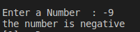

#Assignment4
write a C program to check if the number is positive or nrgative 
<p style =" color : red; text-align :center ">########## Console-output ########</p>

### <p style ="color : white; background-color : black ;text-align : left ; font-size:20px " >Enter a Number: 9  <br> the is positive  <br> </p> 

#The Idea 
the idea is very simple 
we can solve it with a trivial solution like `if` 
``` c
#include<stdio.h>
void main ()
{
    int var1;
    printf("Enter a Number  : ");
    scanf("%d",&var1);

    if ( var1 > 0)
    {
        printf("the number is positive \n");
    }
    else if (var1<0)
    {
        printf("the number is negative \n");
    }
    else 
    {
    printf("the number is equal to zero \n");
    }
    
}
```
# :writing_hand: Demo 

