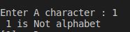

#Assignment5
write a C program to check wether a character is a alphabet or not 

<p style =" color : red; text-align :center ">########## Console-output ########</p>

### <p style ="color : white; background-color : black ;text-align : left ; font-size:20px " >Enter a character : a  <br> a is alaphbet  <br> </p> 

#The Idea 
the idea is very simple 
we can solve it with a trivial solution like `if` 
``` c
#include<stdio.h>
void main ()
{
    char  var1;
    printf("Enter A character : ");
    scanf("%c",&var1);

    if(((var1 >= 'a')&&(var1<='z') )|| ((var1>='A')&&(var1<='Z')) )
    {
        printf(" %c is alphabet \n",var1);
    }
    else 
    {
        printf(" %c is Not alphabet \n",var1);
    }
    
}
```
#or you can use a built in function `isalpha`
```c
#include<stdio.h>
#include<ctype.h>
    char  var1;
    printf("Enter A character : ");
    scanf("%c",&var1);
    if (isalpha(var1)) {
        puts("it's a letter");
    } else if (isdigit(var1)) {
        puts("it's a digit");
    } else {
        puts("something else?");
    }
```
# :writing_hand: Demo 
