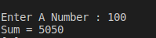

#Assignment6
write a C program to calculate Sum of Natural Numbers 

<p style =" color : red; text-align :center ">########## Console-output ########</p>

### <p style ="color : white; background-color : black ;text-align : left ; font-size:20px " >Enter a number : 100  <br> Sum = 5050 </p> 

#The Idea 
the idea is very simple example of loops 
we can solve it with a trivial solution like `for ` or `while` or `dowhile` 
``` c
#include<stdio.h>
void main ()
{
    int  var1,i ,sum=0;
    printf("Enter A Number : ");
    scanf("%d",&var1);
    for(i=1;i<=var1;i++)
    {
        sum+=i;
    }
    printf("Sum = %d\n",sum);
}
```
# :writing_hand: Demo 
