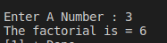

#Assignment7
write a C program to calculate factorial of a number 

<p style =" color : red; text-align :center ">########## Console-output ########</p>

### <p style ="color : white; background-color : black ;text-align : left ; font-size:20px " >Enter a number : 3  <br> Factorial is  = 6 </p> 

#The Idea 
factorial of a number **n**is given by
factorial = 1 * 2 * 3 * 4 *....*n 
so a for loop that begin from 1 to n is enough 

``` c
#include<stdio.h>
void main ()
{
    int  var1,i ,fac=1;
    printf("Enter A Number : ");
    scanf("%d",&var1);
    for(i=1;i<=var1;i++)
    {
        fac *=i;
    }
    printf("The factorial is = %d\n",fac);
}
```
#Anther impementation using recursion 
```c
int get_fac(int n)
{
    // exit condition 
    if (n == 1)
    return 1;
    else
    {
        return (n*get_fac(n-1));
    }
}
```
# :writing_hand: Demo 
