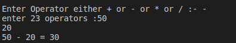

#Assignment7
write a C program to Make a Simple Calculator to Add , Subtract , Multiply or devide 


<p style =" color : red; text-align :center ">########## Console-output ########</p>

### <p style ="color : white; background-color : black ;text-align : left ; font-size:20px " >Enter Operator either + or - or * or / :- + <br> enter 2 operators : 5<br> 2 <br> 5+2=7</p> 


``` c
#include<stdio.h>
void main ()
{
    int  var1,var2 ,result;
    char choice ;
    printf("Enter Operator either + or - or * or / :- ");
    scanf("%c",&choice);
    printf("enter 2 operators :");
    scanf("%d %d",&var1,&var2);
    switch (choice)
    {
    case '+':
        /* code */
        printf("%d + %d = %d\n",var1,var2,var1+var2);
        break;
    case '-':
        printf("%d - %d = %d\n",var1,var2,var1-var2);
        /* code */
        break;
    case '*':
        printf("%d * %d = %d\n",var1,var2,var1*var2);
        /* code */
        break;
    case '/':
        printf("%d / %d = %d\n",var1,var2,var1/var2);
        /* code */
        break;
    
    default:
    printf("wrong operater \n");
        break;
    }
}

```

# :writing_hand: Demo 
